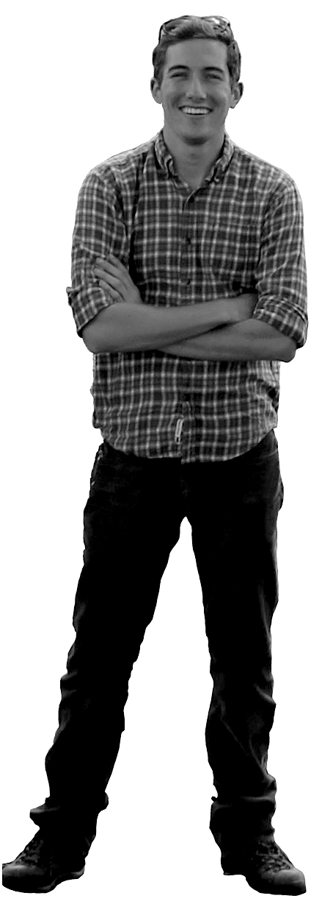

# About

Cooper Elsworth is a PhD candidate in the [Department of Geophysics at Stanford University](https://earth.stanford.edu/geophysics "Stanford Geophysics") and a member of the [SIGMA group](https://pangea.stanford.edu/researchgroups/sigma/ "SIGMA"). His research focuses on the coupled processes governing streaming ice flow in Western Antarctica. Previously, he attended Penn State University, where he completed BS and MS degrees in Engineering Mechanics, focusing on computational methods for fluid-structure interaction. His research interests include coupled systems, fluid dynamics, glaciology and computational mechanics.

&nbsp;&nbsp;&nbsp;&nbsp;In SIGMA, Cooper studies the stability and dynamics of ice streams, specifically those on the Siple Coast of West Antarctica. These fast-flowing features act as the main drainage routes from the interior of the continent and have the potential to adjust on time-scales much shorter than previously expected.
