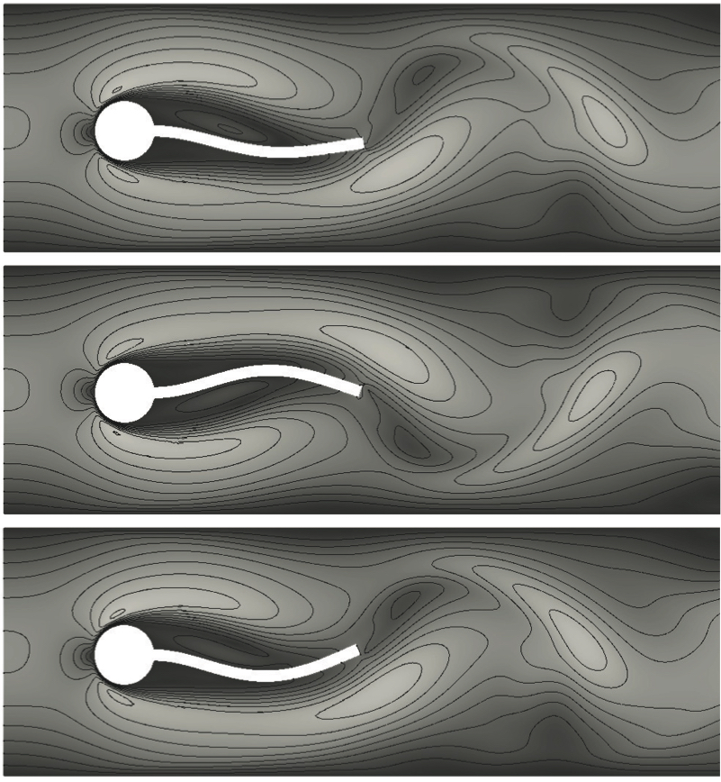

  <h6>A</h6>
  

  <h2 id="siple-coast-ice-streams">Siple Coast Ice Streams</h2>
  
Ice streams are corridors of rapid ice flow draining the ice sheets. They can exhibit astonishing spatial variability on annual to centennial time scales. We propose that changes in the subglacial drainage of meltwater could induce these sudden rearrangements of ice streams. We develop a two-dimensional, thermomechanical model representing an ice stream cross section and couple it to a plastically deforming bed with spatially variable meltwater influx. We find that where ice flows over deformable sediments and lacks significant topographic control, the efficiency of subglacial water drainage exerts direct control on the velocity, location, and width of ice streams. This implies that meltwater percolation at the meter scale could have a significant effect on the short-term variability in ice loss from a continental-scale ice sheet. We verify our model against previous analytical results and validate it against surface observations from the Siple Coast of West Antarctica.

	<h6 id="publications">Publications</h6>
	
Elsworth, C.W., J. Suckale (2016), <em>Rapid ice flow rearrangement induced by subglacial drainage in West Antarctica</em>, Geophysical Research Letters, 43(22), 11697-11707. <a href="http://onlinelibrary.wiley.com/doi/10.1002/2016GL070430/full">Link</a>

  <h6>A</h6>
  

  <h2 id="fluid-structure-interaction">Fluid-Structure Interaction</h2>
  
An overset grid methodology is developed for the fully coupled analysis of fluid-structure interaction (FSI) problems. The overset grid approach alleviates some of the computational geometry difficulties traditionally associated with Arbitrary-Lagrangian-Eulerian (ALE) based, moving mesh methods for FSI. Our partitioned solution algorithm uses separate solvers for the fluid (finite volume method) and the structure (finite element method), with mesh motion computed only on a subset of component grids of our overset grid assembly. Our results indicate a significant reduction in computational cost for the mesh motion, and element quality is improved. Numerical studies of the benchmark test demonstrate the benefits of our overset mesh method over traditional approaches.

  <h6 id="publications-1">Publications</h6>
	
Miller, S., R.L. Campbell, C.W. Elsworth, J.S. Pitt, D.A. Boger (2014), <em>An Overset Grid Method for Fluid-Structure Interaction</em>, World Journal of Mechanics, 4, 217-237. <a href="http://www.scirp.org/journal/PaperInformation.aspx?paperID=48290">Link</a>

